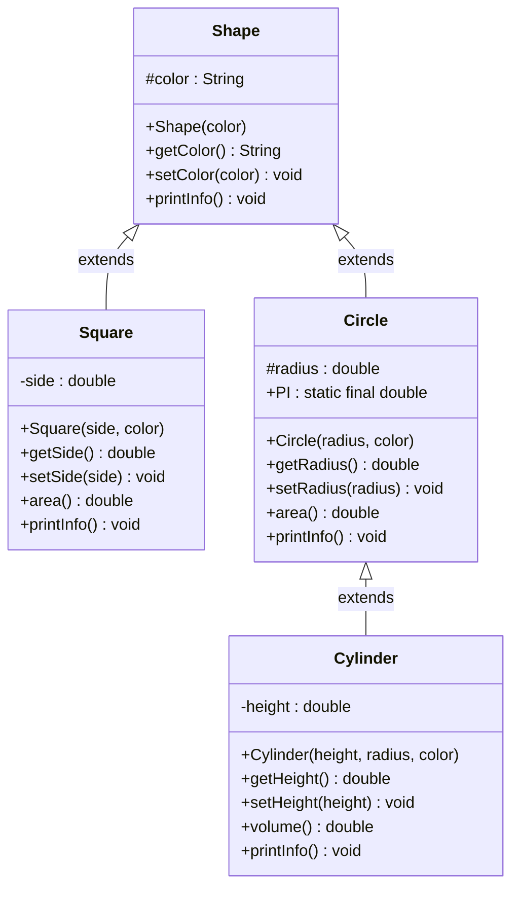
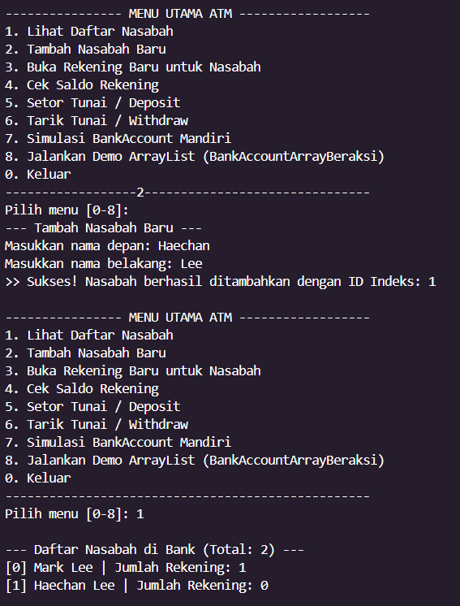
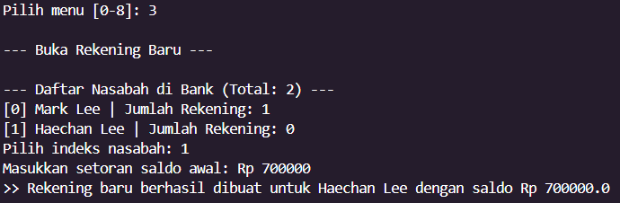
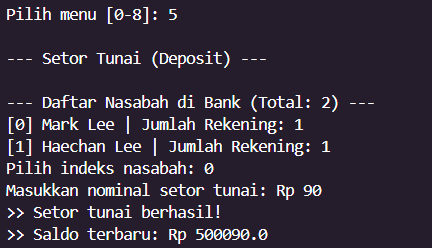
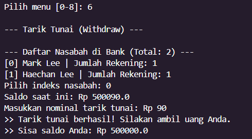

# Object-Oriented Programming (OOP) Course Repository

This repository contains practical assignment projects for the **Object-Oriented Programming (OOP)** college course, organized into separate packages corresponding to weekly topics and assignments.

> **Note:** This `README.md` is actively maintained and will be continuously updated alongside new coursework, topics, and assignments throughout the semester.

---

## Packages & Assignment Modules Overview

| Package | Core OOP Topic | Description |
| :--- | :--- | :--- |
| **`BankSystem`** | **Array & ArrayList of Objects** | Bank customer and account management using fixed-size arrays and dynamic list manipulation (`ArrayList`). |
| **`Shapes`** | **Encapsulation, Inheritance, & Polymorphism** | 2D and 3D geometric shape hierarchy implementing the three fundamental pillars of OOP. |
| **`BangunDatar`** | **Class, Constructor Overloading, & Methods** | 2D shape perimeter and area calculations with overloaded constructors. |
| **`HouseTax`** | **Object Relationships (Composition/Aggregation)** | Entity association (`Father` has a `House`) for property tax (PBB) calculation. |
| **`CalculateBMI`** | **Class & Basic Encapsulation** | Human biological data processing (`Human`) and body mass index (BMI) status determination. |

---

## 1. Package `BankSystem` (Topic: Array & ArrayList)

This package demonstrates how to store, manage, and manipulate collections of objects (*Array of Objects*) using both fixed-size primitive arrays and dynamic collections (`ArrayList`).

### A. Fixed-Size Array (`Array of Objects`)

1. **Customer Array in [`Bank.java`](src/BankSystem/Bank.java):**
   - **Declaration & Allocation:**
     ```java
     private Customer[] customers = new Customer[100]; // Fixed array with a capacity of 100 Customer objects
     private static int numberOfCustomers = 0;
     ```
   - **Adding Elements to the Array:**
     New elements are inserted using `numberOfCustomers` as an index tracker:
     ```java
     public void addCustomer(String f, String l) {
         Customer newCustomer = new Customer(f, l);
         customers[numberOfCustomers] = newCustomer; // Store object into array slot
         numberOfCustomers++;
     }
     ```
   - **Accessing Array Elements:**
     Objects are retrieved by index (`id`):
     ```java
     public Customer getCustomer(int id) {
         return customers[id];
     }
     ```

2. **Accounts Array in [`Customer.java`](src/BankSystem/Customer.java):**
   - Each customer can hold up to 5 bank accounts:
     ```java
     private Account[] accounts = new Account[5]; // Fixed limit of 5 accounts per customer
     private int numberOfAccounts = 0;
     ```
   - **Capacity Bounds Checking:**
     ```java
     public void setAccount(Account acct) {
         if (numberOfAccounts < 5) {
             accounts[numberOfAccounts++] = acct;
         }
     }
     ```

---

### B. Dynamic Collections (`ArrayList`)

In [`BankAccountArrayBeraksi.java`](src/BankSystem/BankAccountArrayBeraksi.java), objects are managed dynamically without pre-allocated size constraints:
- **Declaration & Initialization:**
  ```java
  ArrayList<BankAccount> accounts = new ArrayList<BankAccount>();
  ```
- **Insertion Operations (`add`):**
  - Append to the end of the list: `accounts.add(new BankAccount(1001));`
  - Insert at a specific index: `accounts.add(1, new BankAccount(1008));`
- **Deletion Operation (`remove`):**
  - Remove an element by its index: `accounts.remove(0);`
- **Inspection (`size`) & Retrieval (`get`):**
  - Access the first element: `accounts.get(0);`
  - Dynamically access the last element: `accounts.get(accounts.size() - 1);`

---

## 2. Package `Shapes` (Topic: Encapsulation, Inheritance, Polymorphism)

This package models a geometric shape hierarchy based on the class diagram to demonstrate the three core pillars of OOP.



### A. Encapsulation
Encapsulation protects object state (*data hiding*) by preventing unauthorized direct access and mediating field interactions via public methods:
1. **Access Modifiers:**
   - The `side` field in [`Square.java`](src/Shapes/Square.java) and `height` in [`Cylinder.java`](src/Shapes/Cylinder.java) are marked `private` to disallow direct external mutation.
   - The `color` field in [`Shape.java`](src/Shapes/Shape.java) and `radius` in [`Circle.java`](src/Shapes/Circle.java) are marked `protected` so derived classes have controlled access while blocking outside packages.
2. **Getters & Setters:**
   - Controlled access is provided through explicit methods such as `getColor()`, `setColor(String color)`, `getSide()`, `setSide(double side)`, `getRadius()`, `setRadius(double radius)`, `getHeight()`, and `setHeight(double height)`.
3. **Logic Encapsulation:**
   - Formula logic for computing area (`area()`) and volume (`volume()`) is encapsulated internally within the respective classes.

---

### B. Inheritance
Inheritance enables a subclass to acquire attributes and methods from a superclass, fostering high code reusability and establishing natural relationships:
1. **Single Inheritance:**
   - `Square extends Shape`: The `Square` class inherits the `color` attribute and methods from `Shape`.
   - `Circle extends Shape`: The `Circle` class inherits common shape characteristics from `Shape`.
2. **Multilevel Inheritance:**
   - `Cylinder extends Circle` (where `Circle` extends `Shape`): The `Cylinder` class inherits the `radius` field and `area()` method from `Circle`, and transitively inherits the `color` attribute from `Shape`.
3. **Constructor Chaining (`super` Keyword):**
   - Subclass constructors pass arguments up to their parent constructors:
     - `Square`: `super(color);`
     - `Circle`: `super(color);`
     - `Cylinder`: `super(radius, color);`

---

### C. Polymorphism
Polymorphism allows methods to exhibit different behaviors depending on the actual runtime object executing them:
1. **Method Overriding (Runtime Polymorphism):**
   - The `printInfo()` method declared in superclass `Shape` is overridden in each subclass to satisfy its specific output format:
     - `Square`: `"Square colored " + color + ", area = " + area()`
     - `Circle`: `"Circle " + color + ", area = " + area()`
     - `Cylinder`: `"Cylinder " + color + ", volume = " + volume()`
2. **Dynamic Method Reuse:**
   - The `volume()` method in `Cylinder` dynamically delegates the base area calculation to `Circle.area()`:
     ```java
     public double volume() {
         return area() * height; // Calls inherited area() implementation from Circle
     }
     ```
3. **Polymorphic Reference (Dynamic Method Dispatch):**
   - Objects of type `Square`, `Circle`, and `Cylinder` can be held in a `Shape` reference (e.g. `Shape[] shapes`). Invoking `printInfo()` executes the specific subclass implementation dynamically at runtime.

---

## 3. Library Information & Build Instructions

* **External Dependencies:** **No third-party libraries or dependencies** are required.
* **Standard Library:** The entire codebase is implemented in pure Java SE / JDK standard library (`java.lang.*`). No Maven or Gradle configurations or extra `.jar` files are needed.

### Compilation and Execution:

Run the following commands from the root directory of the workspace:

```bash
# Compile and run BankSystem
javac -d bin src/BankSystem/*.java
java -cp bin BankSystem.Main

# Compile and run Shapes
javac -d bin src/Shapes/*.java
java -cp bin Shapes.Main
```

### Expected Output for `Shapes.Main`:
```text
==================================================
            PROGRAM PERHITUNGAN SHAPES            
==================================================

--- Input Square ---
Masukkan sisi (side): 10
Masukkan warna (color): red

--- Input Circle ---
Masukkan jari-jari (radius): 7
Masukkan warna (color): blue

--- Input Cylinder ---
Masukkan tinggi (height): 10
Masukkan jari-jari (radius): 7
Masukkan warna (color): yellow

==================================================
                 HASIL PERHITUNGAN                
==================================================
Square colored red, area = 100.0
Circle blue, area = 153.86
Cylinder yellow, volume = 1538.6
```

---

## 4. Program Execution Screenshots

### A. BankSystem Interactive ATM Flow

#### 1. Adding a New Customer & Viewing Customer List (Menu 2 & Menu 1)
Demonstrates dynamically adding a customer into the `Bank.customers` array and displaying all registered customers:



#### 2. Opening a New Account for Customer (Menu 3)
Demonstrates creating a new `Account` object and assigning it to a customer's `accounts[]` array:



#### 3. Deposit Transaction (Menu 5)
Demonstrates calling the `deposit()` method on an `Account` object to increase balance:



#### 4. Withdrawal Transaction (Menu 6)
Demonstrates calling the `withdraw()` method on an `Account` object with balance validation:



